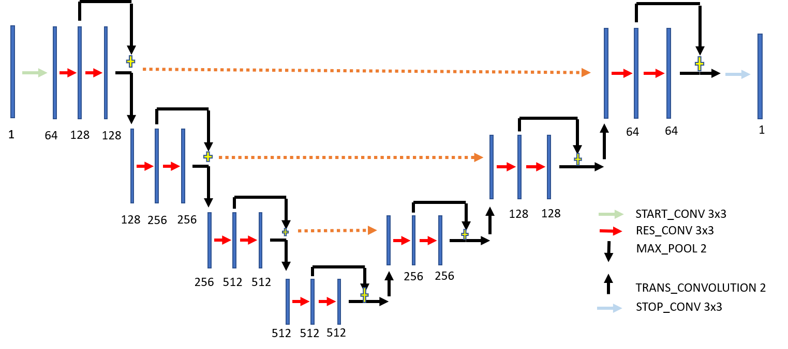
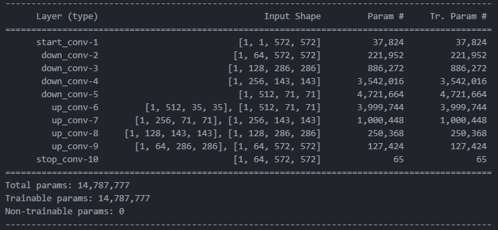
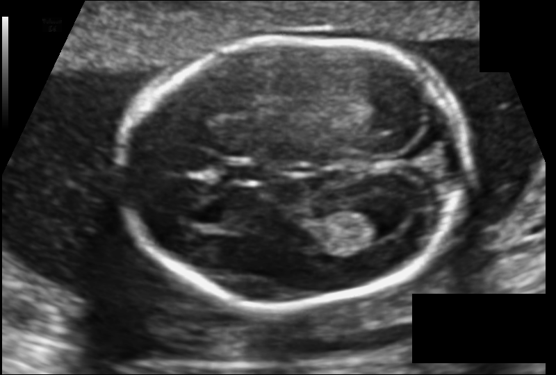
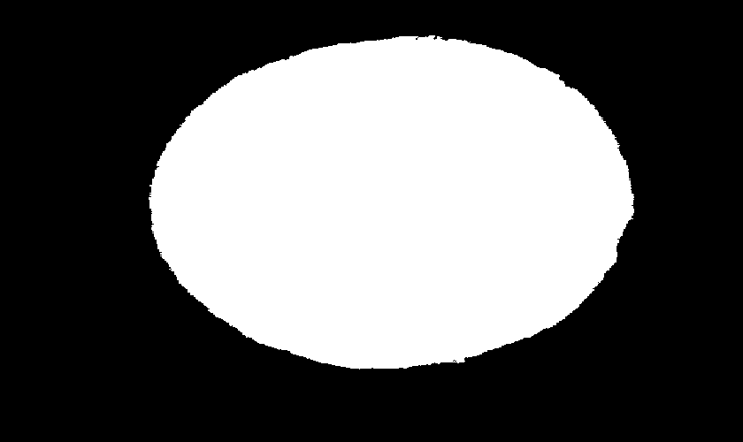
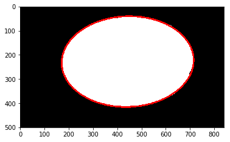
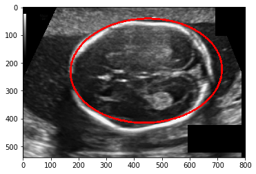

# Fetal-head-segmentation-and-circumference-measurement-from-ultrasound-images
This repo is a **PyTorch** implementation of a **U-Net** model for the **segmentation** of ultrasound images in order to estimate the circumference of the head of the fetus. The dataset used for the project was taken from the <a href="https://hc18.grand-challenge.org/">HC18</a> challenge.

## U-Net 
The U-Net implemented is shown in the figure below:

The encoder contains 3x3 convolutions with same padding followed by maxpool layers. The used activation function was **ReLU**. 
**Resnet** like addition connections were incorporated in the network to promote gradient flow during backpropagation. Decoder was implemented using Transverse convolutions with **sigmoid** activation. **Binary corss entropy loss** was used as the loss function and the model reached a **Dice score of 0.95** for the validation data in just **30 epochs**.
The summary of the model is as following:

A model trained for 30 epochs can be found <a href="https://drive.google.com/file/d/1x2eVD-hbtPk5GxOu5NWNzLAyIGa0siKi/view?usp=sharing"> here</a>.

## Problem Statement
The problem statement of the <a href="https://hc18.grand-challenge.org/">HC18</a> challenge was to model the head of the fetus as an **ellipse**. The approach employed to solve the problem was to **segment** the **fetal head** followed by using **Hough transform** to fit the ellipse. The **Unet** model was trained to segment the ultrasound images and ellipse fitting was performed using the **OpenCV** implementation of **Hough transforms**.
The results are as follows:

### Segmentation
Input image                                      |  Segmentation result
:-----------------------------------------------:|:---------------------------------------------------------:
   |  

### Hough Trasform For Ellipse Fitting
Ellipse fitted on the segmented image            |  Ellipse with reference image
:-----------------------------------------------:|:---------------------------------------------------------:
 |   

## References
- Thomas L. A. van den Heuvel, Dagmar de Bruijn, Chris L. de Korte and Bram van Ginneken. Automated measurement of fetal head circumference using 2D ultrasound images. PloS one, 13.8 (2018): e0200412.
- Thomas L. A. van den Heuvel, Dagmar de Bruijn, Chris L. de Korte and Bram van Ginneken. Automated measurement of fetal head circumference using 2D ultrasound images [Data set]. Zenodo. http://doi.org/10.5281/zenodo.1322001
- Olaf Ronneberger, Philipp Fischer, and Thomas Brox, U-Net: Convolutional Networks for Biomedical Image Segmentation. https://arxiv.org/pdf/1505.04597.pdf
